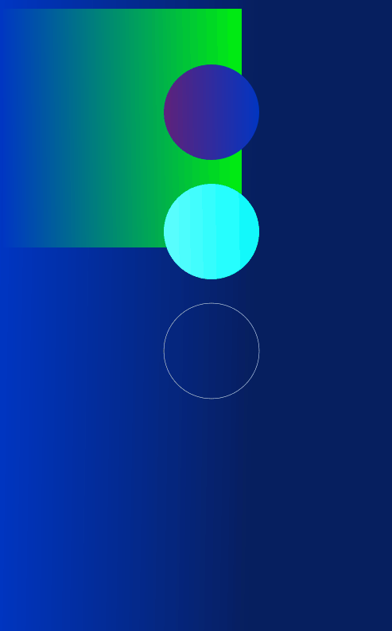

# Animated Gradient
Moving gradients using vanilla js.

http://www.mnl.space/Animated-Gradient/

## Site Deployment
Deploying using Github Pages in the repo settings:

### References
- https://htmlcolorcodes.com
- https://developer.mozilla.org/en-US/docs/Games/Tutorials/2D_Breakout_game_pure_JavaScript
- https://en.wikipedia.org/wiki/Middleware
- https://developer.mozilla.org/en-US/docs/Web/JavaScript/Reference/Classes/extends
- https://developer.mozilla.org/en-US/docs/Glossary/Middleware
